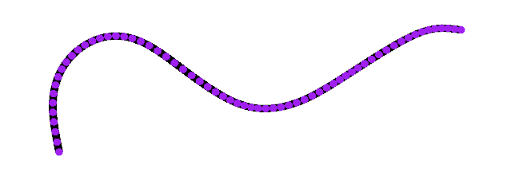
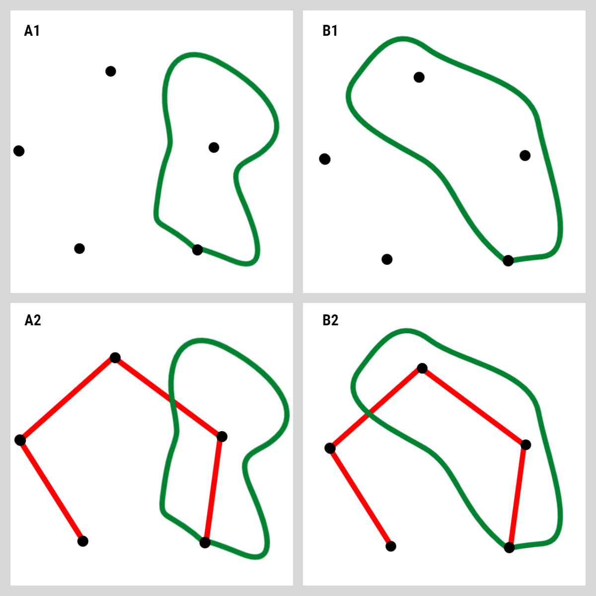
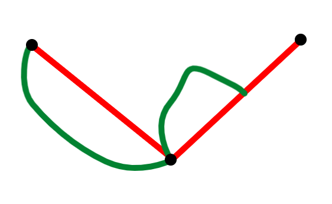

# Design Doc

The goal of this project is to implement a program for playing
Sprouts. The program should:
-   support multiple platforms
-   try to smooth out any curve that a player draws
-   detect and prevent invalid moves
-   detect when the game has ended (detect whether there are any valid moves
    left to draw)

## Framework choice

LibGDX framework was chosen because it is a cross-platform game development
framework and because I (@Glusk) was most familiar with the Java programming
language. Alternative frameworks may include: Unity, Unreal Engine,... They
all seemed too feature-rich for a simple 2D drawing game.

## Curve drawing

The program shall sample a touch or a mouse pointer as the user is dragging
to connect two sprouts with a curve. Sampling and smoothing shall occur in
stages:
1.   All points along the drag gesture will be stored into a sample list, such
     that the last point in the sample is always a minimum distance apart from
     the previous one in the list. This can be thought of as some form of a
     [radial distance simplification](http://psimpl.sourceforge.net/radial-distance.html).
2.   Next, the sample will be further simplified using the
     [perpendicular distance simplification](http://psimpl.sourceforge.net/perpendicular-distance.html).
3.   The simplified sample from (3.) will be used to construct B-spline
     *control points* (or *a control polygon*) as described
     [here](https://www.math.ucla.edu/~baker/149.1.02w/handouts/dd_splines.pdf).
4.   Once B-spline control points are computed we can produce smoothly glued
     cubic Bézier splines.
5.   The curve produced in (4.) shall be cut into small pieces and stored
     as a polyline approximation.

The above stages occur every time a drag is detected by the program. Sample
from (1.) is created only once per stroke but all the other stages (2.-5.)
repeat as more stroke points are sampled. This is inefficient. As the curve is
being drawn, smoothening and approximation only needs to occur on a sublist
near the end of the sample. But that leads to other issues, such as merging the
already smoothened and approximated part of the curve with the updated end.

Time complexities of the simplification algorithms are `O(n)` where `n` is
the sample size. Using the Thomas Algorithm, the computation of the B-spline
control points is also linear. Constructing and approximating the Bézier curve
increases the total point count by a factor of `SPLINE_SEGMENT_COUNT` - the
number of segments with which each Bézier spline is approximated. Thus, a
player's stroke can be sampled, smoothened, approximated and drawn onto the
screen in linear time.

This is how a curve produced in this manner looks like. Purple points are the
result of (5.), connected together by straight black line segments.



The test application can be found here:
[`TestCurve.java`](core/src/main/java/com/github/glusk2/sprouts/core/test/TestCurve.java)

## Game position modeling

The most natural way to represent a game position is to use a graph, having
sprouts as its vertices and the curves that a player draws as its edges.

We want to have a [*connected*](https://en.wikipedia.org/wiki/Connectivity_(graph_theory))
graph - a graph with a single [*component*](https://en.wikipedia.org/wiki/Component_(graph_theory)).
That way we can differentiate between the combinatorially different moves.

### Cobweb



Consider 2 moves with the same endpoints (A1 and B1). We have no mechanism to
distinguish between the two moves.

Because sprouts are not connected at the start of the game, we introduce
"dummy" edges, called *the cobweb* (A2 and B2). Such edges may be intersected
by the moves that the players draw. By convention, we will mark cobweb edges
and vertices red. We now have a connected structure the entire time and we can
easily discriminate between the moves that start and end in the same sprout.

### Vertices
| Label | Position | Color |
|---|---|---|
| `v1` | `(x1, y1)` | black |
| `v2` | `(x2, y2)` | black |
| `v3` | `(x3, y3)` | black |

A simple design like this will not work:
```java
Set<Vertex> vertices;

public final class Vertex {
    public Vertex(String label, Vector2 position, Color color) {
        this.label = label;
        this.position = position;
        this.color = color;
    }
    /* Getters */
    public String label();
    public Vector2 position();
    public Color color();

    public int hashCode() {
        return label().hashCode();
    }
    public boolean equals(Object that) {
        return this.label().equals(that.label());
    }
}
```
If we want to update color or position of a vertex, we have to either
make `Vertex` mutable or locate and update all occurrences of the old `Vertex`
object with the new `Vertex` object that contains the updated values. Both
options seem hacky. 

A decoupling of a vertex from its attributes is needed:

``` java
Map<String, VertexAttributes> vertices;

public final class VertexAttributes {
    public final Vector2 position;
    public final Color color;

    public VertexAttributes(Vector2 position, Color color) {
        this.position = position;
        this.color = color;
    }
}
```

There also has to be some sort of mechanism in place that will generate unique
vertex labels. One way to do so would be:
`label = "v" + atomicInteger.incrementAndGet();`.

 **Note**: new graph vertices will only need to be generated when:
   - there's an intersection between a submove and a cobweb edge
   - player adds a middle sprout

Since the application runs in a single thread, there is no need for an atomic
integer. A simple design like this would suffice:

``` java
public final class Label {
    public Label(int id) {...}

    @Override
    String toString() {
        return "v" + id;
    }

    Label next() {
        return new Label(id + 1);
    }
}
```

Initial sprouts will be labeled from `v(n-1)` to `v0` where `n` is the number
of sprouts. For example, if `n` is equal to `3`, we have: `v-2`, `v-1` and
`v0`. All subsequent labels will have a positive integer postfix.

### Edges
| Endpoints | Polyline | Color |
|---|---|---|
| `v1,v2` | `(x1, y1), ..., (x2, y2)` | black |
| `v2,v3` | `(x2, y2), ..., (x3, y3)` | black |

Possible design:
``` java
Map<Endpoints, EdgeAttributes> edges;

public final class Endpoints {
    private Set<String> endpoints;
    public Endpoints(String v1, String v2) {
        this(new HashSet<String>(Arrays.asList(v1, v2)));
    }
    private Endpoints(Set<String> endpoints) {
        this.endpoints = endpoints;
    }

    /** Returns the endpoints pair as an array. */
    String[] endpoints();
    boolean equals(Object that);
    int hashCode();
}
public final class EdgeAttributes {
    // Should be unmodifiable
    public final LinkedList<Vector2> polyline;
    public final Color color;

    public EdgeAttributes(LinkedList<Vector2> polyline, Color color) {
        this.polyline = polyline;
        this.color = color;
    }
}
```

At some point during the game, we can detect 2 connections with the same
endpoints but different polylines (a cobweb edge and a player-drawn curve).



As a rule, the red edge always needs to be removed in such situations. This
simplifies the combinatorial representation and the overall design (because
we can ensure that the endpoints point to exactly one edge). To test 2 edges
for equality we only need to compare the endpoint vertices and not the
polylines!

A concept of a *directed edge* is also needed:

``` java
public final class DirectedEdge {
    public DirectedEdge(
        String from,
        String to,
        Map<Endpoints, EdgeAttributes> edges,
        Map<String, VertexAttributes> vertices
    ) {
        this(
            from,
            to,
            edges.get(new Endpoints(from, to)),
            vertices.get(from),
            vertices.get(to)
        );
    }
    public DirectedEdge(
        String from,
        String to,
        EdgeAttributes edge,
        VertexAttributes fromAttr,
        VertexAttributes toAttr
    ) {
        this(from, to, new DirectedPath(fromAttr, toAttr))
    }
    public DirectedEdge(String from, String to, Iterable<Vector2> path) {
        this.from = from;
        this.to = to;
        this.path = path;
    }
    public String from();
    public String to();
    public Iterable<Vector2> path();
    public DirectedEdge rev() {
        return new DirectedEdge(to, from, edges, vertices);
    }
}

public final class DirectedPath implements Iterable<Vector2> {
    public DirectedPath(
        VertexAttributes from,
        VertexAttributes to,
        EdgeAttributes edge
    ) {
       this.from = from;
       this.to = to;
       this.edge = edge;
    }
    public Iterator<Vector2> iterator() {
        if (
            from.position.equals(edge.polyline.getFirst()) &&
            to.position.equals(edge.polyline.getLast())
        ) {
            return edge.polyline.iterator();
        }
        else if (
            to.position.equals(edge.polyline.getFirst()) &&
            from.position.equals(edge.polyline.getLast())
        ) {
            return edge.polyline.descendingIterator();
        }
        throw new IllegalArgumentException();
    }
 }
```

The use of `LinkedList` seemed right because of `getFirst()`, `getLast()` and
`descendingIterator()` methods. These methods come in handy when figuring out
the polyline direction in relation to its endpoints. Besides, we don't need
random access.

### Local Rotations
```
v1: v2
v2: v1, v3
v3: v2
```

Possible design:

``` java
Map<Endpoints, EdgeAttributes> edges;
Map<String, VertexAttributes> vertices;

public final class AdjacencyList {
    public AdjacencyList(edges) {...}
    public Map<String, Set<String>> list() {...}
}

public final class LocalRotations {
    public LocalRotations(edges, vertices, adjacencyList) {}

    public DirectedEdge next(DirectedEdge fi) {
        String v1 = fi.from();

        Map<String, Set<String>> adjacencyList = adjacencyList.list();
        
        // generate DirectedEdges for adjacencyList.get(v1);
        TreeSet<DirectedEdge> lr = new TreeSet<DirectedEdge>(/*new RadialComparator(v1)*/);
        for (String v2 : adjacencyList.get(v1)) {
            lr.add(new DirectedEdge(v1, v2, edges, vertices));
        }
        // add fi to the set
        lr.add(fi);
        // find the next DirectedEdge after fi and return it
        DirectedEge next = lr.higher(fi);
        if (next == null) {
            next = lr.first();
        }
        return next;
    }
}
```

### Faces

| Boundary |
|---|
| `v1, v2, v3` |
| `v2, v4` |

A graph face is uniquely defined by the ordered sequence of its boundary vertices.

We need to be able to:
1.   check whether a cobweb edge is located in two faces
2.   query a face by on one of its boundary arrows (DirectedEdges)

``` java
public class Face {
    public Face(LinkedList<String> vertexBoundary) {
    }
    public boolean contains(DirectedEdge arrow);
    public boolean contains(Endpoints edge);
}
```

There should also be a separate object called `Faces` that can compute
all of the faces of a given `Graph`:

``` java
public class Faces {
    public Faces(Graph graph) {...}
    public Set<Face> faces() {...}
    /**
     * Look for the first red edge that resides in two separate faces and
     * return it. If no such edge exists, return null.
    */
    public Endpoints firstSharedRedEdge() {...}
}
```

### Graph

We need an object that will keep track of `edges`, `vertices`.

Possible design:

``` java
public interface Graph {
    Map<Endpoints, EdgeAttributes> edges();
    Map<String, VertexAttributes> vertices();
    Faces faces();
}
```

When a player draws a curve, it can be thought of as a sequence of one or more
submoves. Each submove starts and ends in a sprout or a cobweb point (if a
submove intersects the cobweb). We can model such submoves as adding edges
to a graph.

#### Preset Graph

A special implementation of the Graph interface with preset edges and vertices,
used for testing and caching.

#### Initial Graph

An implementation of the Graph interface that generates `n` sprouts
(black vertices) and connects them into a *single component* graph. The points
generated in this way will not be random but that doesn't really matter.

The most straight-forward way to do this is to draw a circle, and generate `n`
points on the circle, equidistant from one another, and connect them in order.
The first and last point should not be connected so that the Graph will only
have one component.

#### Graph After A Submove

An implementation of the Graph interface that applies a submove
(a directed edge) to an existing graph.

Graph can be simplified after each submove.

Before the submove is applied, check if the existing graph already contains
a red edge with the same endpoints as the submove. If so, remove the red edge
and apply the submove.

Once the submove is applied, check if any two faces share a red edge. If so,
remove at most one such edge.

Finally, remove any red points with no red edges.

#### Graph After Adding A Middle Sprout

An implementation of the Graph interface that splits one of the black edges
in two by adding a new sprout on the connection.

If the new sprout is close to a red point, paint it black.

#### Vertex degree

A degree of a vertex is a number of edges that are incident to the vertex.
We also wish to specify the color of the incident edges that we wish to count.

Possible design:

``` java
public final class VertexDegree extends Number {
    public VertexDegree(edges, vertexLabel, edgeColor) {
        this(edges, new AdjacencyList(edges), vertexLabel, edgeColor);
    }
    public VertexDegree(edges, adjacencyList, vertexLabel, edgeColor) {...}
}
```

## Reference

- [LibGDX | Guidelines | Performance considerations](https://libgdx.badlogicgames.com/documentation/hacking/Contributing.html#performance-considerations)
