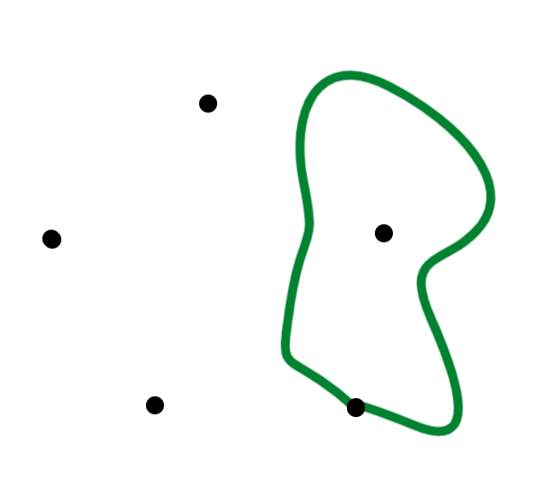
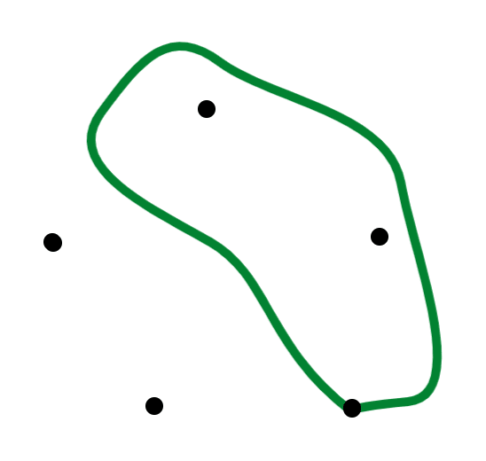
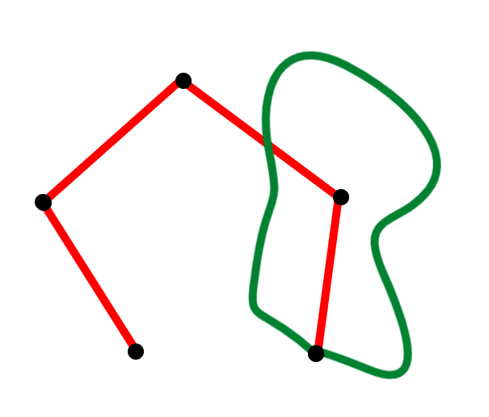
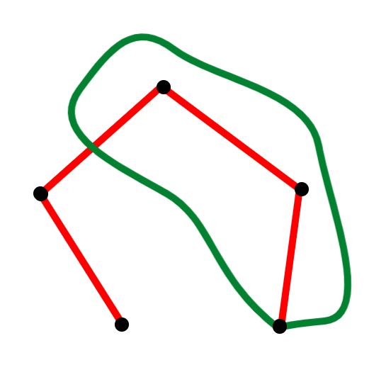

# Design Doc

The goal of this project is to implement a program for playing
Sprouts. The program should:
-   support multiple platforms
-   try to smooth out any curve that a player draws
-   detect and prevent invalid moves
-   detect when the game has ended (detect whether there are any valid moves
    left to draw)

## Framework choice

LibGDX framework was chosen because it is a cross-platform game development
framework and because I (@Glusk) was most familiar with the Java programming
language. Alternative frameworks may include: Unity, Unreal Engine,... They
all seemed too feature-rich for a simple 2D drawing game.

## Curve drawing

The program shall sample a touch or a mouse pointer as the user is dragging
to connect two sprouts with a curve. Sampling and smoothing shall occur in
stages:
1.   All points along the drag gesture will be stored into a sample list, such
     that the last point in the sample is always a minimum distance apart from
     the previous one in the list. This can be thought of as some form of a
     [radial distance simplification](http://psimpl.sourceforge.net/radial-distance.html).
2.   Next, the sample will be further simplified using the
     [perpendicular distance simplification](http://psimpl.sourceforge.net/perpendicular-distance.html).
3.   The simplified sample from (3.) will be used to construct B-spline
     *control points* (or *a control polygon*) as described
     [here](https://www.math.ucla.edu/~baker/149.1.02w/handouts/dd_splines.pdf).
4.   Once B-spline control points are computed we can produce smoothly glued
     cubic Bézier splines.
5.   The curve produced in (4.) shall be cut into small pieces and stored
     as a polyline approximation.

The above stages occur every time a drag is detected by the program. Sample
from (1.) is created only once per stroke but all the other stages (2.-5.)
repeat as more stroke points are sampled. This is inefficient. As the curve is
being drawn, smoothening and approximation only needs to occur on a sublist
near the end of the sample. But that leads to other issues, such as merging the
already smoothened and approximated part of the curve with the updated end.

Time complexities of the simplification algorithms are `O(n)` where `n` is
the sample size. Using the Thomas Algorithm, the computation of the B-spline
control points is also linear. Constructing and approximating the Bézier curve
increases the total point count by a factor of `SPLINE_SEGMENT_COUNT` - the
number of segments with which each Bézier spline is approximated. Thus, a
player's stroke can be sampled, smoothened, approximated and drawn onto the
screen in linear time.

This is how a curve produced in this manner looks like. Purple points are the
result of (5.), connected together by straight black line segments.


The test application can be found here:
[`TestCurve.java`](core/src/main/java/com/github/glusk2/sprouts/core/test/TestCurve.java)

## Game modeling

The most natural way to represent a game position is to use a graph, having
sprouts as its vertices and the curves that a player draws as its edges.

We want to have a [*connected*](https://en.wikipedia.org/wiki/Connectivity_(graph_theory))
graph - a graph with a single [*component*](https://en.wikipedia.org/wiki/Component_(graph_theory)).
That way we can differentiate between the combinatorially different moves.

Consider the following moves with the same endpoints:



---



We have no mechanism to distinguish between the two moves.

Because sprouts are not connected at the start of the game, we introduce
"dummy" edges, called *the cobweb*. Such edges may be intersected by the moves
that the players draw. By convention, we will mark cobweb edges and vertices red.

Now we have a connected structure the entire time and we can easily
discriminate between the moves that start and end in the same sprout:



---



We can consider two different representation of the game: *geometric* and
*combinatorial*.

### Geometric representation

Geometric representation consists of curves and points drawn on the screen.
The following classes can be used to model that:

- `Vector2` (part of libGDX)
- [`Polyline`](core/src/main/java/com/github/glusk2/sprouts/core/geom/Polyline.java)

### Combinatorial representation

A combinatorial representation if a more abstract view of the game. Essentially
it is a graph.

#### Vertices
| Label | Position | Color |
|---|---|---|
| `v1` | `(x1, y1)` | black |
| `v2` | `(x2, y2)` | black |
| `v3` | `(x3, y3)` | black |

Possible design:
``` java
Map<String, VertexAttributes> vertices;

public final class VertexAttributes {
    public final Vector2 position;
    public final Color color;

    public VertexAttributes(Vector2 position, Color color) {
        this.position = position;
        this.color = color;
    }
}
```

#### Edges
| Endpoints | Polyline | Color |
|---|---|---|
| `v1,v2` | `(x1, y1), ..., (x2, y2)` | black |
| `v2,v3` | `(x2, y2), ..., (x3, y3)` | black |

Possible design:
``` java
Map<Set<String>, EdgeAttributes> edges;

public final class EdgeAttributes {
    // Should be unmodifiable
    public final LinkedList<Vector2> polyline;
    public final Color color;

    public VertexAttributes(LinkedList<Vector2> polyline, Color color) {
        this.polyline = polyline;
        this.color = color;
    }
}
```

The use of `LinkedList` seemed right because of `getFirst()` and `getLast()`
methods. These methods will come in handy when figuring out the polyline
direction in relation to its endpoints. Besides, we don't need random access.

#### Local Rotations
```
v1: v2
v2: v1, v3
v3: v2
```

## Reference

- [LibGDX | Guidelines | Performance considerations](https://libgdx.badlogicgames.com/documentation/hacking/Contributing.html#performance-considerations)
